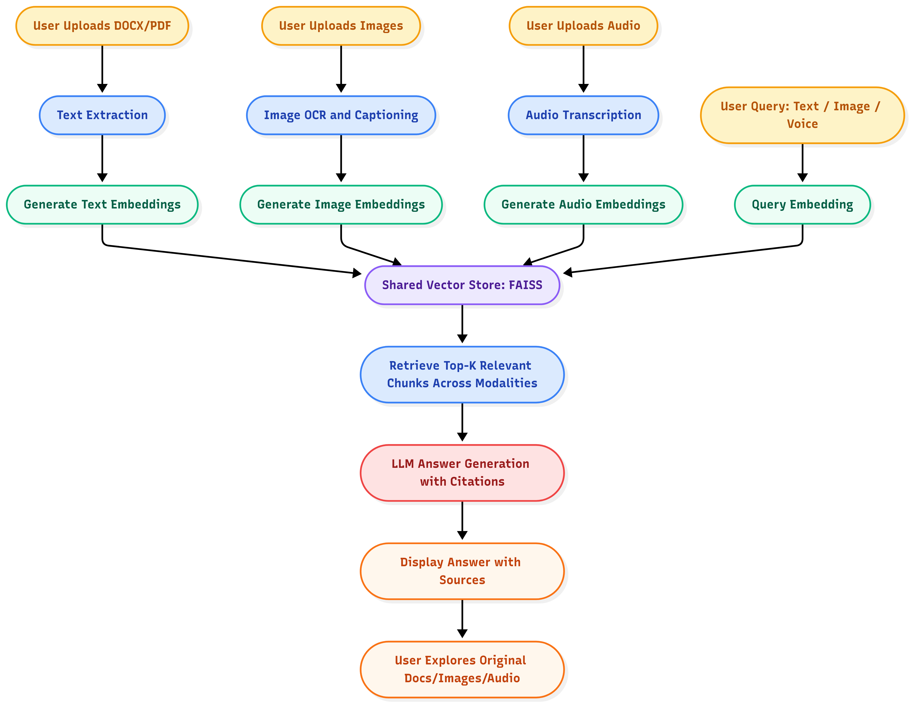

# Multi-Modal RAG System

A modular Retrieval-Augmented Generation (RAG) pipeline that combines **text, image, and audio understanding** with **FAISS-based semantic search** and **LLM-powered Q&A**.
The system automatically extracts embeddings, builds a local vector index, and answers queries grounded in document context with proper citation based answers along with original documents.

---

## Features

* **Multi-modal ingestion** (text, images, audio)
* **FAISS-based semantic vector search**
* **Cross Encoder** support for better relevance scoring
* **MMR reranking** for diverse retrieval
* **LLM-based Q&A engine** (OpenRouter, Groq, etc.)
* **Streamlit UI** for quick testing
* **Cross-document citations** (experimental)
  Users can query relationships **across multiple documents or modalities**, such as
  *“What does this image represent based on the information in this audio file?”*
  Works best when the **RAG top-k value** is increased for broader context recall.
  For audio queries, the system also returns the **exact time segment** where relevant content appears.

---

## System Architecture

### Architecture Overview

The architecture illustrates how the Multi-Modal RAG System processes and answers user queries across **text, image, and audio modalities**.

1. **User Uploads**
   - Users can upload **PDFs**, **images**, or **audio files**.
   - Each file type follows its respective preprocessing pipeline.

2. **Processing Pipelines**
   - **Text Processor (PyMuPDF4LLM):** Extracts clean text, sections, and tables from PDFs or text-based files.
   - **Image Processor (Qwen-VL or Groq):** Generates short descriptive captions for images or charts.
   - **Audio Processor (Faster-Whisper):** Transcribes speech into text while preserving timestamps.

3. **Shared Vector Store (FAISS)**
   - All embeddings (from text, image captions, and audio transcripts) are stored in a **shared FAISS index**.
   - This enables **cross-modal semantic retrieval**, meaning the system can relate an image to its corresponding audio or document segment.

4. **Retrieval Layer**
   - When a user asks a question, the system retrieves **Top-K semantically similar chunks** across all modalities using **MMR reranking** to ensure diversity.

5. **Answer Generation**
   - The retrieved chunks are passed to the **LLM (Groq/OpenRouter)** which generates a contextual response.
   - The answer includes **citations**, referencing the source file and segment (for example, timestamps for audio).

6. **Cross-Citation Feature**
   - The system can compare or relate multiple documents, such as *“What does the image describe based on the audio narration?”*.
   - Works best when the **Top-K retrieval value** is increased for better multi-document context.

7. **User Interface**
   - Finally, results are shown in the Streamlit app with highlighted **citations**, file references, and relevant audio timestamps.


## Project Structure

```
.
├── app.py                        # Streamlit entry point
│
├── core/
│   ├── embedding.py              # Embedding generation
│   ├── ingestion.py              # Unified ingestion pipeline
│   ├── retriever.py              # Context retrieval + reranking
│   └── vector_indexer.py         # FAISS index builder/loader
│
├── processors/
│   ├── audio_processor.py        # Transcribes audio inputs
│   ├── image_processor.py        # Captions images using vision model (Groq)
│   ├── image_initializer.py      # LLM handler (Groq)
│   └── text_processor.py         # Extracts text & tables from PDFs
│
├── qa/
│   └── qa_engine.py              # Main Q&A logic
│
├── utils/
│   ├── image_utils.py            # Image save/load utilities
│   ├── constants.py              # Path and config constants
│   └── app_utils.py              # Generic utility functions
│
└── user_data/
    └── user_id/                  # FAISS indexes and user embeddings
```

---

## Installation

```bash
# 1. Clone the repository
git clone https://github.com/kaushik-yadav/Multi-Modal-RAG.git
cd Multi-Modal-RAG

# 2. Create a virtual environment
python -m venv venv
source venv/bin/activate       # macOS/Linux
venv\Scripts\activate          # Windows

# 3. Install dependencies
pip install -r requirements.txt
```

---

## Usage

### Run the app

```bash
streamlit run app.py
```

### Upload Documents

1. Upload **PDFs**, **images**, or **audio files**
2. The ingestion pipeline extracts content and builds a FAISS index
3. Ask natural-language questions about your files

---

## Example Queries

| Modality       | Example Input             | Example Query                                                         |
| -------------- | ------------------------- | --------------------------------------------------------------------- |
| PDF            | `research_paper.pdf`      | “Summarize the key findings of section 3”                             |
| Image          | `chart.png`               | “What does this graph show?”                                          |
| Audio          | `lecture.mp3`             | “What topic is being discussed here?”                                 |
| Cross-Citation | `notes.pdf + lecture.mp3` | “What does the professor say about the topic mentioned in section 2?” |

---

## Environment Variables

Create a `.env` file in the root directory:

```
OPENROUTER_API_KEY=your_openrouter_key
GROQ_API_KEY=your_groq_key
ASSEMBLYAI_API_KEY=your_assemblyai_key
```

---

## Modular Design Philosophy

Each subsystem is isolated:

* **Processors** handle content extraction per modality
* **Core** modules handle embeddings, indexing, and retrieval
* **QA** layer orchestrates query answering with LLMs
* **Utils** provides shared helpers and constants

This separation makes it easy to:

* Swap embedding models
* Change vector databases
* Replace LLM backends (OpenAI, Groq, Gemini, etc.)
